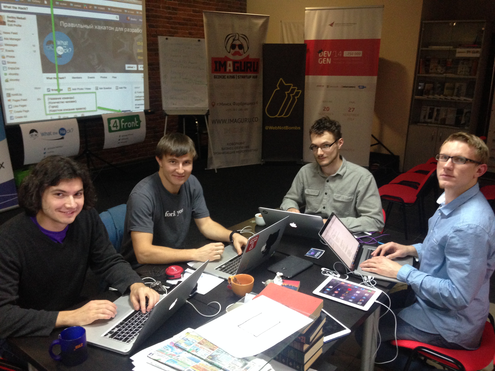
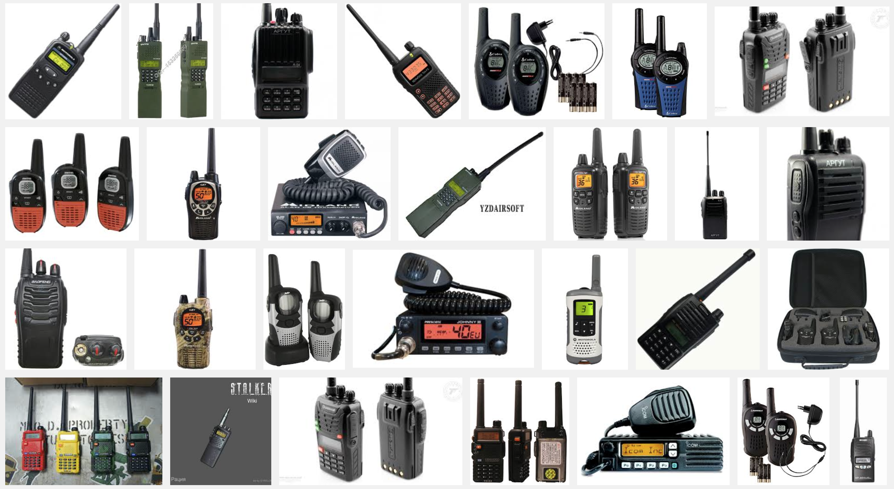
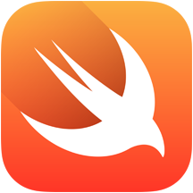
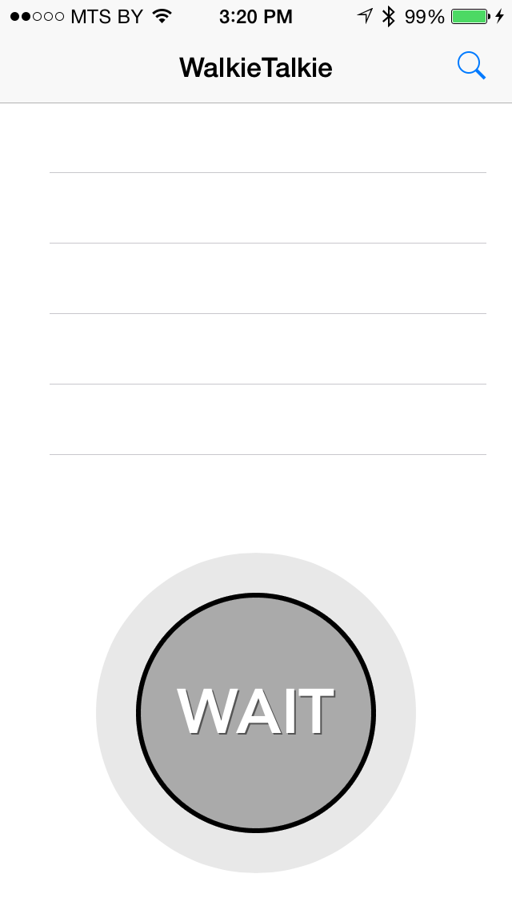
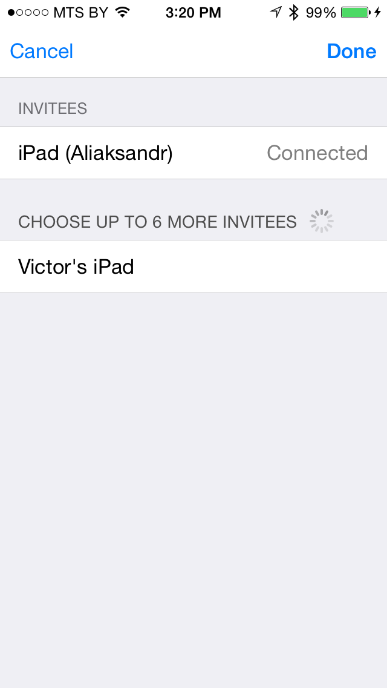
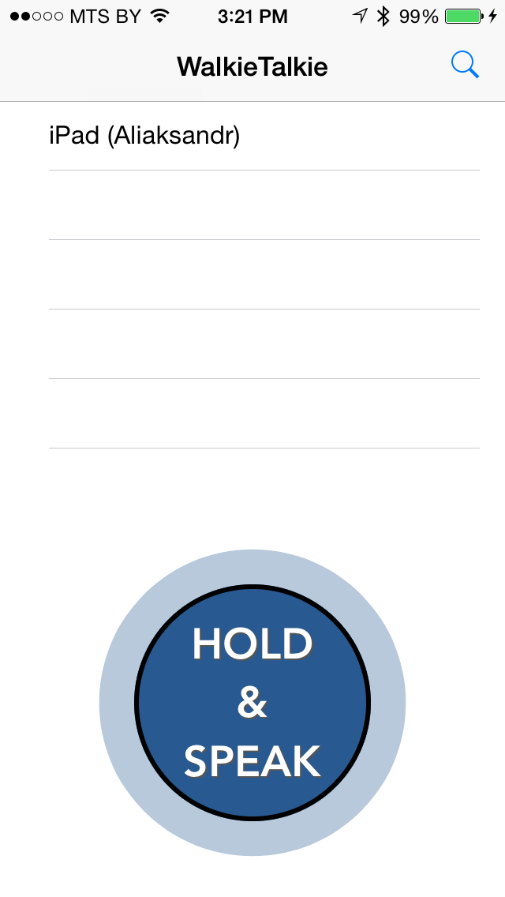
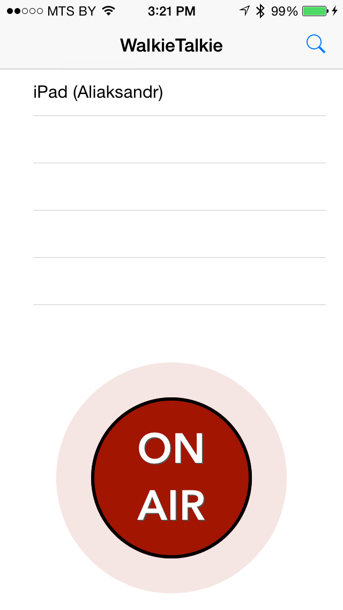

# [fit] WalkieTalkie
## by CocoaHeads Belarus

---

# [fit] Who we are?

* **Cyril Lashkevich**, Viber. *@notorca*
* **Aliaksandr Andrashuk**, Viber. *@lime_jelly*
* **Victor Ilyukevich**, CareZone. *@yas375*
* **Konstantin Salak**, Viaden. *@stillk*

---

# [fit] What our project is about?

---

# [fit] It's a walkie-talkie…

--- 

# [fit] …for iOS devices

---

# [fit] …written in Swift*!

\* With just a little pieces in Objective-C and C.

---

# [fit] Technology Stack

* Bonjour for device advertising and discovery
* Wi-Fi and Bluetooth for communication
* Object Oriented APIs of Audio Unit added in iOS 8
* Up to 8 devices can participate
* Swift, C, Objective-C

**Source code:** *https://github.com/notorca/walkietalkie/*

---

# [fit] Demo

---

---

---

---

---

# [fit] Thanks
